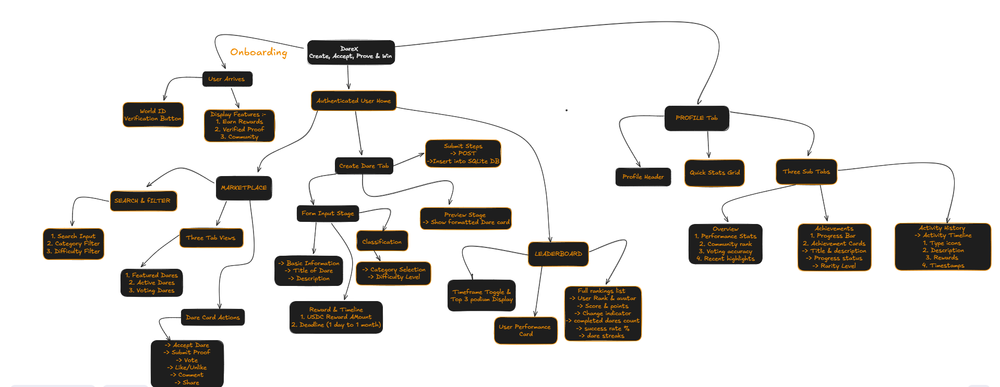

# DareX

## Overview

**DareX** is a decentralized truth-and-dare platform where users can participate in fun challenges while preserving privacy. Participants verify their identities without revealing personal information, submit proof of challenge completion, and engage in microtransactions to vote on the outcomes of others. The platform ensures fair rewards distribution using a decentralized architecture.

This project leverages the following technologies:

* **World App Mini App** – Frontend interface for users.
* **Filecoin WARM Storage** – Decentralized storage for photos and videos submitted as proof of dare completion.

## How It Works

1. **Access Mini App**: Users open DareX as a Mini App within the World App or Telegram.
2. **Wallet Login**: Users authenticate using their World App wallet or any other integrated wallet.
3. **Identity Verification**: Participants verify their identity.
4. **Create Dares**: Users or event organizers create dares with associated rewards.
5. **Submit Proof**: Participants attempt the dare and upload photos/videos to Filecoin Storage via the Mini App.
6. **Community Voting / Betting**: The community votes on whether the dare was successfully completed. Microtransaction allow users to vote on outcomes.
7. **Reward Distribution**:

   * Winners who complete the dare receive the dare reward.
   * Users who vote correctly receive payouts.
   * All transactions are transparent and automated via the Mini App.

## Features

* Privacy-preserving identity verification
* Decentralized microtransaction voting
* Long-term decentralized storage for proofs (Filecoin Storage)
* Community-driven challenge validation
* Accessible on mobile through World App or Telegram Mini App

## Tech Stack

* **Frontend**: World App/Telegram Mini App
* **Proof Storage**: Filecoin Storage
* **Smart Contracts**: Solidity / EVM-compatible for votes and rewards

## Getting Started

1. **Open World App/Telegram** and navigate to the DareX Mini App.
2. **Connect Wallet**: Authenticate via your World App wallet or integrated.
3. **Verify Identity**: Complete verification.
4. **Explore Dares**: Browse available dares or create a new one.
5. **Participate & Upload Proof**: Complete a dare and upload your photo/video proof to Filecoin.
6. **Bet & Vote**: Participate in voting for other users’ dare submissions.
7. **Claim Rewards**: Receive payouts based on dare outcomes and voting results.

## Resources & Links

* [World App Mini App Docs](https://docs.world.org/mini-apps)
* [Filecoin WARM Storage Docs](https://filecoin.io/developers/warm-storage)